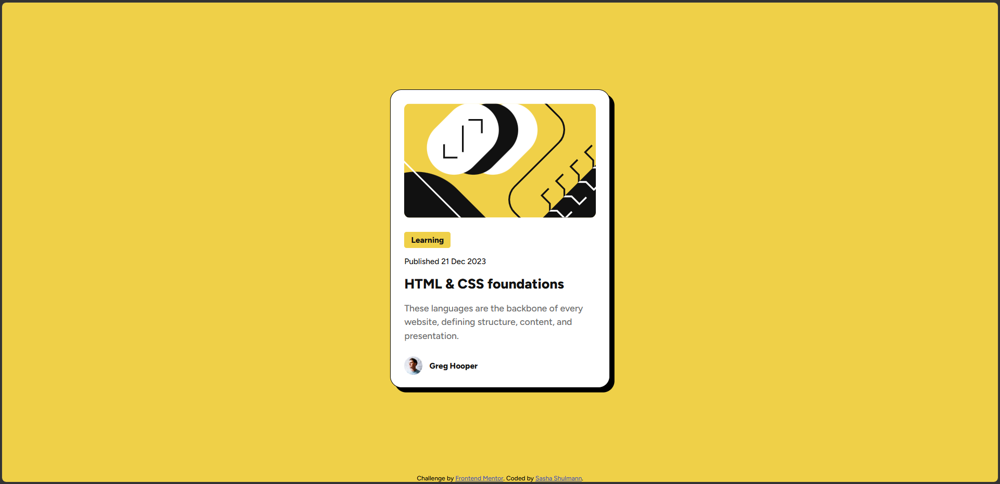

# Frontend Mentor - Blog preview card solution

This is a solution to the [Blog preview card challenge on Frontend Mentor](https://www.frontendmentor.io/challenges/blog-preview-card-ckPaj01IcS).

## Table of contents

- [Overview](#overview)
  - [The challenge](#the-challenge)
  - [Screenshot](#screenshot)
  - [Links](#links)
- [My process](#my-process)
  - [Built with](#built-with)
  - [What I learned](#what-i-learned)
  - [Continued development](#continued-development)
- [Author](#author)

## Overview

### The challenge

Users should be able to:

- See hover and focus states for all interactive elements on the page
- View the card layout correctly on different screen sizes

### Screenshot

](./images/image.png)

### Links

- Solution URL: [Git repo](https://github.com/saha-ra-code/Blog-preview-card)
- Live Site URL: [Live site](https://saha-ra-code.github.io/Blog-preview-card/)

## My process

### Built with

- Semantic HTML5 markup
- CSS custom properties
- Flexbox
- Mobile-first workflow
- Google Fonts

### What I learned

In this project, I practiced building a small card component with semantic HTML and clean CSS. I focused on matching the design closely, using spacing, typography, border radius, and hover states.

One important part was centering the card on the page with Flexbox:

```css
main {
  flex: 1;
  display: flex;
  justify-content: center;
  align-items: center;
}
```

I also learned how useful small utility classes can be for styling specific parts of a component, such as the article description and author section.

### Continued development

I want to keep practicing:

- Responsive layouts
- CSS spacing and typography
- Semantic HTML structure
- Matching designs more accurately from Figma

## Author

- Sasha Frostman [@saha-ra-code](https://github.com/saha-ra-code)
